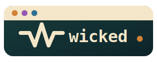

<p align="center">
  
</p>

<h1 align="center">Wicked.jl</h1>

<p align="center">
  A Julia-first framework for serious terminal applications.
</p>

<p align="center">
  <a href="https://julialang.org/"></a>
  
  
  
  <a href="docs/FEATURE_PARITY.md"></a>
</p>

> [!WARNING]
> Wicked.jl is `0.0.1` and under active development. Local implementation and
> automated evidence are strong, but Linux real-terminal compatibility evidence,
> immutable release-candidate approvals, and independent application validation
> remain before a production release. See [Release Evidence](docs/RELEASE_EVIDENCE.md).

## Build terminal software, not terminal glue

Wicked.jl combines the best ideas from Ratatui, Textual, TamboUI, and Lanterna
without importing their language or runtime constraints:

| You need | Wicked gives you |
| --- | --- |
| Fast, explicit rendering | Buffers, frames, Unicode-aware cells, layouts, minimal diffs, and stateful widgets. |
| Application structure | An explicit model/update/view runtime with commands, subscriptions, cancellation, and diagnostics. |
| Polished composition | Keyed Toolkit elements, focus, routed events, forms, overlays, themes, semantic trees, and pilots. |
| Trustworthy tests | Headless buffers, snapshots, semantic assertions, pilots, virtual time, and deterministic event routing. |

```julia
using Wicked.API

buffer = Buffer(5, 42)
frame = Frame(buffer)
render!(frame, Paragraph("Deploy safely. Observe everything."), frame.area)
```

The same rendering primitives power dashboards, data explorers, interactive
CLIs, administration consoles, and full-screen applications.

## Choose your level

### 1. Immediate mode: direct and deterministic

Use widgets with explicit state when you own the frame loop.

```julia
using Wicked.API

widget = List(["Build", "Test", "Release"])
state = ListState(selected=1)
buffer = Buffer(4, 24)

render!(Frame(buffer), widget, buffer.area, state)
handle!(state, widget, KeyEvent(Key(:down)); viewport_height=4)
```

### 2. Managed runtime: explicit application state

Use the runtime when updates, commands, subscriptions, timers, workers, and
cleanup should have a single observable lifecycle. The runtime is deliberately
Elm-like: your application owns its model, `update!` changes it, and `view`
renders it.

Read the [architecture guide](docs/ARCHITECTURE.md) and
[validation strategy](docs/VALIDATION_STRATEGY.md) before introducing services
or background work.

### 3. Toolkit: retained identity, immediate rendering underneath

Use keyed elements for full applications with focus and routed input. Toolkit
components reuse the same renderers as the immediate API.

```julia
using Wicked.API

tree = ToolkitTree(
    Element(Button("Deploy", :deploy); id=:deploy, key=:deploy, focusable=true),
)
frame = Frame(Buffer(3, 24))
render_toolkit!(frame, tree)

semantics = toolkit_semantic_tree(tree)
```

## Install and load

Wicked targets **Linux terminals** on Julia `1.10` and later. The rendering
core has no native UI or `ncurses` dependency.

```julia
import Pkg
Pkg.add("Wicked") # when published to the Julia registry
```

For a local checkout or an unreleased branch:

```julia
import Pkg

Pkg.develop(path="/path/to/Wicked.jl")
Pkg.instantiate()
Pkg.precompile()
```

Use the stable facade in application entry points:

```julia
using Wicked.API
```

`Wicked.API` is the default developer surface for applications, widgets,
backends, runtime code, Toolkit components, testing utilities, and extension
points. `Wicked.Experimental` remains as a compatibility module, but the current
reviewed baseline has no application-facing experimental bindings. Future
experimental exports require a promote, qualify, or remove decision in
`api/experimental_promotions.tsv`.

## Find the right API quickly

Start from the stable API route map when choosing an architecture or porting code
from another TUI framework: [API Reference Overview](docs/API_REFERENCE.md#developer-route-map).

| If you are building | Start with |
| --- | --- |
| Ratatui-style immediate render loops | [Core API](docs/API_CORE.md) and [Immediate Widgets API](docs/API_WIDGETS.md) |
| Standard app shell chrome | [Immediate Widgets API](docs/API_WIDGETS.md) and `examples/app_shell_quickstart.jl` |
| Textual-style component trees and reactive state | [Toolkit and Reactive API](docs/API_TOOLKIT.md) |
| Managed full-screen applications | [Backends and Runtime API](docs/API_BACKENDS_RUNTIME.md) |
| Keybindings and shortcut help | [API Reference Overview](docs/API_REFERENCE.md#developer-route-map) and `examples/keybindings_quickstart.jl` |
| Stabilizing or promoting widgets | [Widget Stabilization Tracker](docs/WIDGET_STABILIZATION.md) |
| CSS-like styling and named themes | [Core styling quickstart](docs/API_CORE.md#stable-styling-quickstart) and [Theme Management](docs/THEMES.md) |
| Forms, menus, dialogs, pickers, and controls | [Controls API](docs/API_CONTROLS.md) and [Navigation and Forms API](docs/API_NAVIGATION.md) |
| Large virtualized lists, tables, and trees | [Virtualization API](docs/API_VIRTUALIZATION.md) |
| Markdown, code, diffs, logs, and terminal captures | [Rich Content API](docs/API_RICH_CONTENT.md) |
| Headless testing, pilots, semantics, and diagnostics | [Semantics, Testing, and Diagnostics API](docs/API_SEMANTICS_TESTING.md) |
| Actions, notifications, progress, themes, reload, and services | [Extensions and Services API](docs/API_EXTENSIONS_SERVICES.md) |

### Predictable precompilation

Use this bootstrap command locally and in CI:

```sh
JULIA_NUM_THREADS=1 julia --project=. --startup-file=no \
  -e 'using Pkg; Pkg.instantiate(); Pkg.precompile(); using Wicked.API'
```

`Pkg.precompile()` builds cache artifacts for the active Julia version,
environment, and manifest. Wicked also ships a conservative precompile workload
for the common in-memory render path: geometry, styles, text, buffers, layout
containers, widget rendering, diffing, and the headless backend. It does not
enter raw terminal mode, load optional dependencies, or run your application
event loop.

First startup is expected to be slower; later loads reuse valid cache entries.
Full troubleshooting and environment guidance: [Loading and precompilation](docs/PACKAGE_LOADING.md).

## What is included

- **Core:** geometry, styles, grapheme-aware text, buffers, frames, capability
  fallback, ANSI and test backends.
- **Layout:** constraints, flex rows and columns, grids, docking, flow/wrap,
  overlays, split panes, clipping, and scrolling.
- **Controls:** text editing, lists, tables, trees, menus, tabs, forms,
  navigation, command palettes, dialogs, notifications, and validation.
- **Rich views:** Markdown, code and diff views, syntax, ANSI-safe text,
  terminal/process views, images with Unicode fallbacks, charts, canvas, and
  calendars.
- **Application services:** focus, themes, accessibility semantics, clipboard,
  drag/drop, virtualization, reactive state, diagnostics, tracing, and testing.

See the [component catalog](docs/COMPONENT_CATALOG.md) for the complete surface
and [feature parity](docs/FEATURE_PARITY.md) for evidence and deliberate deltas.
When porting examples from Ratatui, Textual, TamboUI, or Lanterna, start with
the [stable widget vocabulary quick map](docs/FRAMEWORK_MIGRATION.md#stable-widget-vocabulary-quick-map).
For a deterministic tour of stable widget names, run
[`examples/widget_gallery.jl`](examples/widget_gallery.jl).
For programmatic discovery, use the stable widget catalog:

```julia
using Wicked.API

widgets = stable_widget_catalog(status=:stable, surface=:stable)
input_widgets = stable_widget_catalog(family=:inputs_and_controls)
count = stable_widget_count()
input_count = stable_widget_count(family=:inputs_and_controls)
names = stable_widget_names()
input_names = stable_widget_names(family="inputs-and-controls")
families = stable_widget_families()
family_catalog = stable_widget_family_catalog()
family_slugs = stable_widget_family_slugs()
families_text = widget_families_text()
family_slugs_text = widget_family_slugs_text()
vocabulary = widget_vocabulary()
vocabulary_records = widget_vocabulary_records()
button_vocab = widget_vocabulary_entry("Button")
button_names = widget_vocabulary_widget_names("Button")
text_entry_names = widget_vocabulary_widget_names("Single-line text field")
vocabulary_matches = search_widget_vocabulary("TextInput")
vocabulary_table = widget_vocabulary_markdown()
vocabulary_tsv = widget_vocabulary_tsv()
button_family = widget_catalog_family(:Button)
button_family_slug = widget_catalog_family_slug(:Button)
input_family_entry = widget_family_entry(:inputs_and_controls)
input_family_records = widget_family_records(family=:inputs_and_controls)
family_catalog_table = widget_family_catalog_markdown(columns=(:family, :family_slug, :count))
family_catalog_tsv = widget_family_catalog_tsv(family=:inputs_and_controls, columns=(:family_slug, :count))
matching_families = search_widget_families("button")
matching_family_count = search_widget_family_count("button")
matching_family_table = search_widget_family_catalog_markdown("button"; columns=(:family_slug, :count))
matching_family_tsv = search_widget_family_catalog_tsv("button"; columns=(:family_slug, :count))
input_family_widgets = widget_family_widgets(:inputs_and_controls)
input_family_names = widget_family_widget_names(:inputs_and_controls)
input_family_count = widget_family_widget_count(:inputs_and_controls)
@assert is_stable_widget_family(:inputs_and_controls)
@assert assert_stable_widget_family(:inputs_and_controls).slug == "inputs-and-controls"
names_text = widget_names_text()
input_names_text = widget_names_text(family="Inputs and controls")
matching_names = search_widget_names_text("button")
matching_input_names = search_widget_names_text("button"; family="Inputs and controls")
sources = widget_source_files()
sources_text = widget_source_files_text()
matching_sources = search_widget_source_files_text("button")
source_summary = widget_source_summary()
source_summary_table = widget_source_summary_markdown()
source_summary_tsv = widget_source_summary_tsv()
family_summary = widget_family_summary()
family_summary_table = widget_family_summary_markdown()
family_summary_tsv = widget_family_summary_tsv()
input_family_summary = widget_family_summary(family="Inputs and controls")
matches = search_widgets("button")
slug_matches = search_widgets("inputs-and-controls")
input_matches = search_widgets("button"; family="Inputs and controls")
match_count = search_widget_count("button")
input_match_count = search_widget_count("button"; family="Inputs and controls")
matches_table = search_widget_catalog_markdown("button"; columns=:name)
slug_matches_table = search_widget_catalog_markdown("inputs-and-controls"; columns=(:name, :family_slug))
matches_tsv = search_widget_catalog_tsv("button"; columns=(:name, :status))
by_source = group_widgets(:source)
by_family = group_widgets(:family)
input_family = group_widgets(:family; family="Inputs and controls")
summary = widget_catalog_summary()
input_summary = widget_catalog_summary(family="Inputs and controls")
table = widget_catalog_markdown(columns=(:name, :source))
family_table = widget_catalog_markdown(columns=(:name, :family, :family_slug))
input_table = widget_catalog_markdown(family="Inputs and controls", columns=(:name, :family))
names_table = widget_catalog_markdown(columns=:name)
records = widget_catalog_records()
input_records = widget_catalog_records(family="Inputs and controls")
tsv = widget_catalog_tsv(columns=(:name, :family, :status))
input_tsv = widget_catalog_tsv(family="Inputs and controls", columns=(:name, :family))
button = widget_catalog_entry(:Button)
same = widget_catalog_entry(Button)
@assert is_stable_widget(:Button)
@assert is_stable_widget(Button("Run", :run))
button_stability = widget_stability_report(:Button)
stability_reports = widget_stability_reports()
stability_gaps = widget_stability_gaps()
stability_table = widget_stability_markdown(columns=(:name, :family, :ready, :blockers))
stability_tsv = widget_stability_tsv(family=:inputs_and_controls, columns=(:name, :ready))
stability_json = widget_stability_json()
stability_summary = widget_stability_summary()
stability_summary_text = widget_stability_summary_text()
experimental_widgets = experimental_widget_names()
candidate_widgets = candidate_widget_names()
stabilization_status = widget_stabilization_status_record()
stabilization_text = widget_stabilization_status_text()
stabilization_json = widget_stabilization_status_json()
stabilization_blockers = widget_stabilization_blockers()
stabilization_blockers_text = widget_stabilization_blockers_text()
@assert widget_stability_ready(:Button)
widget_stability_is_complete = widget_stability_complete()
widget_stability_is_complete && assert_widget_stability_complete()
@assert assert_widget_stability_ready(:Button).ready
stabilization_status.ready && assert_widget_stabilization_ready()
family_closeouts = widget_family_closeout_reports()
blocked_families = widget_family_closeout_gaps()
closeout_summary = widget_family_closeout_summary()
closeout_table = widget_family_closeout_markdown(columns=(:family, :status, :blockers))
closeout_json = widget_family_closeout_json(status=:blocked)
closeout_artifacts = widget_family_closeout_artifacts(columns=(:family, :status, :blockers))
closeout_artifacts_json = widget_family_closeout_artifacts_json()
closeout_artifacts_text = widget_family_closeout_artifacts_text()
family_closeout_complete = widget_family_closeout_complete()
family_closeout_complete && assert_widget_family_closeout_complete()
@assert assert_widget_family_closeout_ready(:toolkit).ready
surface_release = widget_surface_release_status_record()
surface_release_text = widget_surface_release_status_text()
widget_surface_release_ready() && assert_widget_surface_release_ready()
```

`WidgetCatalogEntry` records the widget name, implementation source, stable
surface, stabilization status, and promotion reason from the reviewed widget
candidate ledger. `WidgetFamilyEntry` records the reviewed family name, stable
slug, widget count, and widget names. `WidgetFamilyCloseoutReport` records
family-level docs, examples, stable API tokens, precompile tokens, notes, and
source-level blockers from `api/widget_family_evidence.tsv`.
Use `widget_family_closeout_complete` and
`assert_widget_family_closeout_complete` when Julia release tooling needs to
fail on any blocked family without shelling out to the renderer.
Use `widget_surface_release_status_record`, `widget_surface_release_ready`,
`assert_widget_surface_release_ready`, `widget_surface_release_status_text`, and
`widget_surface_release_status_json` when tooling needs one combined stable
widget-surface release gate.
`WidgetVocabularyEntry` records the cross-library concept map used when porting
Ratatui, Textual, TamboUI, and Lanterna examples to Wicked API names.
`WidgetStabilityReport` combines the catalog row with behavior coverage
evidence and reports blockers that must be closed before a candidate or
compatibility widget can be treated as stable.
Use `experimental_widget_names`, `candidate_widget_names`,
`widget_stabilization_status_record`, `widget_stabilization_status_text`, and
`widget_stabilization_status_json`, `widget_stabilization_blockers`, and
`widget_stabilization_blockers_text`
when release tooling needs to answer whether any compatibility or non-stable
widget surface remains before running the heavier release gates.
Catalog helpers derive cross-library families such as `"Inputs and controls"` or
`"Data and virtualization"` for porting guides, galleries, and release closeout
reports.

## Build an application safely

### Terminal lifecycle

Terminal state is a resource boundary. Use a scoped terminal session so raw mode,
alternate screen, cursor state, mouse tracking, focus reporting, and bracketed
paste are restored after normal exit, errors, interrupts, or signals.

```julia
using Wicked.API

terminal = Terminal(AnsiBackend(stdin, stdout))
with_terminal(terminal) do active
    draw!(active) do frame
        render!(frame, Paragraph("Hello from Wicked.jl"), frame.area)
    end
end
```

For recovery procedures and fallback behavior, read
[Terminal Recovery](docs/TERMINAL_RECOVERY.md) and
[Terminal Compatibility](docs/TERMINAL_COMPATIBILITY.md).

### Test before opening a real terminal

Start with `Buffer` and `TestBackend` for deterministic rendering tests. Use
`WidgetPilot`, `ToolkitPilot`, `RuntimePilot`, `pilot_semantic_tree`,
`pilot_semantic_snapshot`, `SemanticQuery`, `query_semantics`,
`query_one_semantic`, `assert_semantic_query`, and `assert_semantic_snapshot` for
interaction and accessibility workflows. This keeps Unicode clipping, layout,
focus, disabled state, keyboard, pointer, semantic queries, and accessibility
behavior testable in CI.

```sh
julia --project=. --startup-file=no -e 'using Pkg; Pkg.test()'
julia --project=. --startup-file=no scripts/widget_audit.jl --require-complete
julia --project=. --startup-file=no scripts/compatibility_widget_alias_audit.jl
julia --project=. --startup-file=no scripts/quality_gate.jl
```

## Developer workflow

| Task | Command or reference |
| --- | --- |
| Install and warm caches | `julia --project=. -e 'using Pkg; Pkg.instantiate(); Pkg.precompile()'` |
| Run all tests | `julia --project=. -e 'using Pkg; Pkg.test()'` |
| Verify widget evidence | `julia --project=. scripts/widget_audit.jl --require-complete` |
| Verify compatibility widget names | `julia --project=. scripts/compatibility_widget_alias_audit.jl` |
| Verify public quality gates | `julia --project=. scripts/quality_gate.jl` |
| Run terminal cleanup evidence | `julia --project=. scripts/pty_gate.jl` |
| Track real-terminal evidence | [Linux Real-Terminal Matrix](docs/REAL_TERMINAL_MATRIX.md) |
| Run widget gallery example | `julia --project=. examples/widget_gallery.jl` |
| Render stable widget catalog | `julia --project=. scripts/render_widget_catalog.jl --format markdown --columns name,source,status --output stable-widgets.md` |
| Count stable widgets | `julia --project=. scripts/render_widget_catalog.jl --count` |
| Count focused widgets | `julia --project=. scripts/render_widget_catalog.jl --count --query button` |
| Require focused widgets | `julia --project=. scripts/render_widget_catalog.jl --query button --min-count 1` |
| Limit focused widgets | `julia --project=. scripts/render_widget_catalog.jl --query button --max-count 20` |
| Render widget names | `julia --project=. scripts/render_widget_catalog.jl --names --output stable-widget-names.txt` |
| Render widget sources | `julia --project=. scripts/render_widget_catalog.jl --sources --output stable-widget-sources.txt` |
| Render widget families | `julia --project=. scripts/render_widget_catalog.jl --families --output stable-widget-families.txt` |
| Render widget family slugs | `julia --project=. scripts/render_widget_catalog.jl --family-slugs --output stable-widget-family-slugs.txt` |
| Render focused widget sources | `julia --project=. scripts/render_widget_catalog.jl --sources --query button` |
| Render focused widget names | `julia --project=. scripts/render_widget_catalog.jl --names --query button` |
| Render focused widget catalog | `julia --project=. scripts/render_widget_catalog.jl --query button --columns name,source` |
| Render widgets by family slug | `julia --project=. scripts/render_widget_catalog.jl --query inputs-and-controls --columns name,family_slug,source` |
| Render widget catalog summary | `julia --project=. scripts/render_widget_catalog.jl --summary --format tsv` |
| Render widget source summary | `julia --project=. scripts/render_widget_catalog.jl --source-summary --format markdown` |
| Render widget family summary | `julia --project=. scripts/render_widget_catalog.jl --family-summary --format markdown` |
| Render widget family catalog | `julia --project=. scripts/render_widget_catalog.jl --family-catalog --format markdown` |
| Render widget family slugs/counts | `julia --project=. scripts/render_widget_catalog.jl --family-catalog --columns family_slug,count` |
| Search widget families | `julia --project=. scripts/render_widget_catalog.jl --family-catalog --query button --columns family_slug,count` |
| Render input/control widgets | `julia --project=. scripts/render_widget_catalog.jl --family "Inputs and controls" --columns name,family,family_slug,source` |
| Render widget stability readiness | `julia --project=. scripts/render_widget_catalog.jl --stability --columns name,family,ready,blockers` |
| Render widget stability summary | `julia --project=. scripts/render_widget_catalog.jl --stability-summary --format tsv` |
| Render widget stability status | `julia --project=. scripts/render_widget_catalog.jl --stability-status` |
| Render widget stability JSON | `julia --project=. scripts/render_widget_catalog.jl --stability-json --output stable-widget-stability.json` |
| Render widget stabilization closeout | `julia --project=. scripts/render_widget_catalog.jl --stabilization-status` |
| Render widget stabilization blockers | `julia --project=. scripts/render_widget_catalog.jl --stabilization-blockers` |
| Render widget stabilization JSON | `julia --project=. scripts/render_widget_catalog.jl --stabilization-json --output stable-widget-stabilization.json` |
| Require widget stabilization readiness | `julia --project=. scripts/render_widget_catalog.jl --stabilization-status --require-stabilization-ready` |
| Require widget stability readiness | `julia --project=. scripts/render_widget_catalog.jl --stability --require-stability-ready` |
| Render stable widget-surface release status | `julia --project=. scripts/render_widget_catalog.jl --surface-release-status` |
| Render stable widget-surface release JSON | `julia --project=. scripts/render_widget_catalog.jl --surface-release-json --output stable-widget-surface-release.json` |
| Require stable widget-surface release readiness | `julia --project=. scripts/render_widget_catalog.jl --surface-release-status --require-surface-release-ready` |
| Render cross-framework widget vocabulary | `julia --project=. scripts/render_widget_catalog.jl --vocabulary` |
| List Wicked names for a porting concept | `julia --project=. scripts/render_widget_catalog.jl --vocabulary-widgets --query Button` |
| Render widget family closeout | `julia --project=. scripts/render_widget_family_closeout.jl --format markdown --columns family,status,docs,examples,blockers,blocker_details` |
| Render blocked widget families | `julia --project=. scripts/render_widget_family_closeout.jl --status blocked --columns family,status,blockers,blocker_details` |
| Render widget family JSON | `julia --project=. scripts/render_widget_family_closeout.jl --format json` |
| Summarize widget family readiness | `julia --project=. scripts/render_widget_family_closeout.jl --summary --format tsv` |
| Run release closeout check | `julia --project=. scripts/render_widget_family_closeout.jl --release-check --require-total-count "$(julia --project=. scripts/render_widget_family_closeout.jl --count)"` |
| Require ready widget families | `julia --project=. scripts/render_widget_family_closeout.jl --require-ready` |
| Require clean git evidence | `julia --project=. scripts/render_widget_family_closeout.jl --require-clean-git` |
| Require expected widget families | `julia --project=. scripts/render_widget_family_closeout.jl --require-total-count "$(julia --project=. scripts/render_widget_family_closeout.jl --count)"` |
| Require zero blocked families | `julia --project=. scripts/render_widget_family_closeout.jl --require-blocked-count 0` |
| Count focused widget families | `julia --project=. scripts/render_widget_family_closeout.jl --count --family toolkit` |
| Render headerless TSV catalog | `julia --project=. scripts/render_widget_catalog.jl --format tsv --no-header --columns name,status` |
| Append widget catalog summary | `julia --project=. scripts/render_widget_catalog.jl --summary --output stable-widgets.md --append` |
| Draft stable widget promotion packet | `julia --project=. scripts/new_stable_promotion_packet.jl --family Stateful-controls --widget ComboBox --source src/AcceptanceWidgets.jl --candidate <sha> --decision promote` |
| Draft parity evidence record | `julia --project=. scripts/new_parity_evidence.jl --family Layout --environment kitty --candidate <sha>` |
| Build the manual | `julia --project=docs docs/make.jl` |

When adding a public widget or subsystem, preserve the contract:

1. Use shared buffers, layout, text, styles, events, and focus primitives.
2. Keep interactive state explicit and testable.
3. Provide constrained rendering, Unicode, keyboard, pointer, disabled, and
   semantic behavior where relevant.
4. Add immediate, Toolkit, and parity evidence before declaring the feature done.
5. Record intentional reference-library differences in the parity artifacts.

## Documentation map

- [Architecture](docs/ARCHITECTURE.md): module boundaries and rendering pipeline.
- [API Reference](docs/API_REFERENCE.md): public API conventions and capabilities.
- [Component Catalog](docs/COMPONENT_CATALOG.md): widget and service inventory.
- [Linux Real-Terminal Matrix](docs/REAL_TERMINAL_MATRIX.md): manual Linux
  terminal evidence worksheet.
- [Reference Parity Survey](docs/REFERENCE_PARITY_SURVEY.md): Ratatui, Textual,
  TamboUI, and Lanterna mapping.
- [Parity Execution Plan](docs/PARITY_EXECUTION_PLAN.md): family-level closure criteria.
- [Stable Promotion Packet Template](docs/STABLE_PROMOTION_PACKET_TEMPLATE.md):
  review packet for candidate or compatibility widgets promoted to `Wicked.API`.
- [Release Checklist](docs/RELEASE_CHECKLIST.md): candidate and release workflow.
- [Release Evidence](docs/RELEASE_EVIDENCE.md): what is verified locally and what
  still requires external proof.
- [Parity Evidence Template](docs/PARITY_EVIDENCE_TEMPLATE.md): record format for
  adapted Ratatui/Textual/TamboUI/Lanterna parity evidence.
- [Parity Evidence Records](docs/evidence/README.md): storage location for
  candidate parity closeout records.
- [Parity Evidence Policy](docs/evidence/parity_policy.json): machine-readable
  family and evidence-shape contract.

## Contributing

Wicked is designed as a production library, not a collection of terminal demos.
Public changes need explicit ownership, deterministic behavior, focused tests,
semantic coverage, documented capability fallback, and reviewed API boundaries.

Read [Feature Parity](docs/FEATURE_PARITY.md),
[Release Checklist](docs/RELEASE_CHECKLIST.md), and
[CONTRIBUTING.md](CONTRIBUTING.md) before starting a subsystem or widget family.

---

<p align="center">
  Built in Julia. Rendered as cells. Tested without a terminal.
</p>
